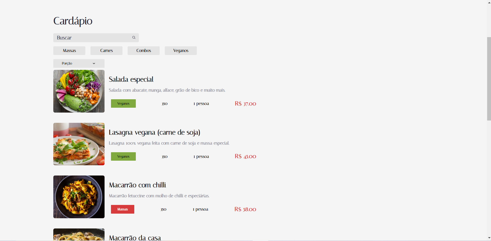

# Aluroni



> Aluroni foi criado no curso React: lidando com arquivos estáticos da alura. É uma aplicação simples de lista de receitas com ordenação, pesquisa e filtragem e foi utilizada para estudar sobre utilização de arquivos estáticos com o Create React App.

## 🚀 Instalando Aluroni

Para instalar o Aluroni, siga estas etapas:

```
npm install
```

## ☕ Usando Aluroni

Para usar Aluroni, siga estas etapas:

Na raiz do projeto, execute no terminal:

```
npm run start
```

Fique à vontade para contribuir!
